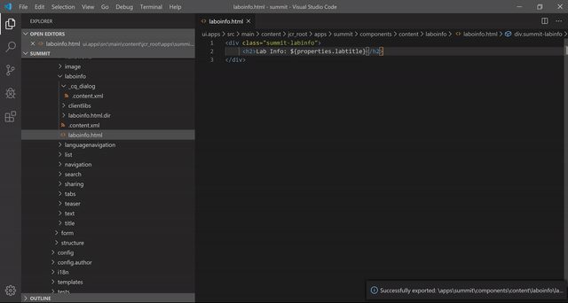

# VSCode AEM Sync

An extention for Visual Studio Code that allows AEM Developer to sync their code updates smoothly.

You can sync not only files also `.content.xml`, `dialog.xml`, etc., can be synced by just one click.

This sync feature is ported from [AEM Brackets Extension](https://github.com/adobe/aem-brackets-extension).

## How to use

1. Open your AEM project on Visual Studio Code

2. Right-click on a file or a folder in Explorer or Editor, and you can choose those two import and export options:
* `Export to AEM Server`
* `Import from AEM Server`

If auto-push feature is enabled, `Export to AEM Server` is executed automatically, when you save.

## Settings

|Name|Description|Default|
|:-|:-|:-|
|aemsync.server|Server URL|http://localhost:4502|
|aemsync.user|Username|admin|
|aemsync.password|Password|admin|
|aemsync.autopush|Automitically synchronize file-system changes to server|false|
|aemsync.acceptSelfSignedCert|Accept self-signed certificates for HTTPs|false|